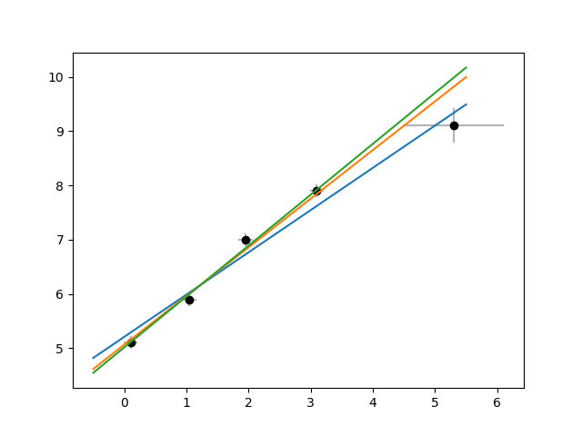
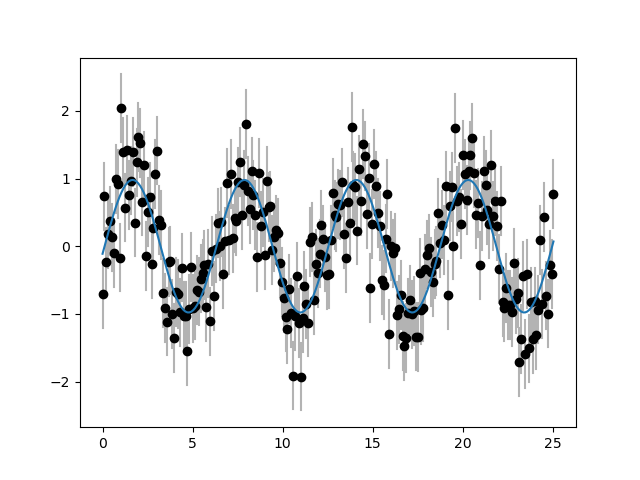
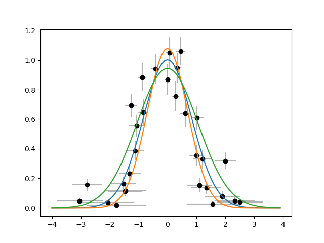
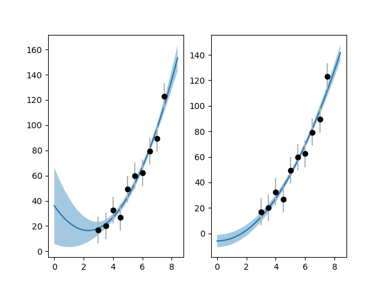

# physfit — Function fitting with errors on both x and y

## Introduction

This package provides a simple framework for fitting functions to
two-dimensional data. It allows you to specify uncertainties not only
on y-coordinates, but also on x-coordinates.

### Example of use

Usage can be as simple as 

    import physfit
    physfit.fit("linear", xx, yy)
    
A range of standard function forms is provided (the most basic being
“linear”, i.e., _y_ = _A_ _x_ + _B_).

### Use with arbitrary functional forms

You can also specify your own arbitrary function form along with an
initial estimate of parameter values, as in:

    physfit.fit(lambda x, A, B: A*x + B, xx, yy, p0=[1, 0])
    
(although in this example, you could have just used
“linear”).

### Specifying uncertainties

With physfit, it is particularly easy to specify measurement
uncertainties on each of your data points:

    physfit.fit("exp", xx, yy, sy=sy)
    
If `sy` is a vector of uncertainties on _y_, this causes each point
to be individually weighted accordingly. Uncertainties on _x_ can
likewise be specified as `sx`. It is even possible to specify the
covariance between _x_ and _y_ errors using `sxy`.

### Retrieving fit results

Each of the above forms directly prints the fit results to your
terminal for quick exploration.  Naturally, you can also store the
results in a variable:

    f = physfit.fit("linear", xx, yy)
    
In that form, `f` becomes a class instance with attributes to
retrieve fit parameters and uncertainties. You can then use this
instance to plot the fitted curve:

    plt.plot(xxx, f(xxx))
    
This works because the return value from `physfit.fit` not only
encapsulates the fitted parameters, but is also a callable
representation of the fitted function.

Plotting the ±1σ confidence interval around the fitted curve is almost
as easy:

    plt.fill_between(xxx, f(xxx) - f.df(xxx), f(xxx) + f.df(xxx))
                     
The object `f` also contains the *R*² value for the fit, 
the χ² value (if you specified uncertainties at least on _y_), and the
covariance matrix between the parameters.

## Installation

Will soon be as easy as

    pip install physfit
    
For now, please copy the file
[“physfit.py”](./src/physfit/physfit.py) into your local Python
environment.

## Fully worked examples

Each of the following assume that you start with:

    import numpy as np
    np.set_printoptions(precision=4) 
    import physfit
    rng = np.random.default_rng(12345)
    import matplotlib.pyplot as plt
    plt.ion()
    
    def plotwitherrors(xx, yy, sx, sy):
        for x, y, dx, dy in zip(xx, yy, sx, sy):
            plt.plot([x, x], [y-dy, y+dy], '-', color=(.7, .7, .7))
            plt.plot([x-dx, x+dx], [y, y], '-', color=(.7, .7, .7))
        plt.plot(xx, yy, 'ko')
    
    
### Perilous outliers

When fitting without specified uncertainties, one poorly measured data
point can have a large impact on fit results. When you can tell the
curve fitter that the point has larger uncertainties associated with
it than the other points, that impact is mitigated:

    xx = [0.1, 1.05, 1.95, 3.1, 5.3]
    yy = [5.1, 5.9, 7.0, 7.9, 9.1]
    sy = [0.1, 0.1, 0.1, 0.1, 0.3]
    sx = [0.1, 0.1, 0.1, 0.1, .8]
    
    f1 = physfit.fit('linear', xx, yy)
    f2 = physfit.fit('linear', xx, yy, sy=sy)
    f3 = physfit.fit('linear', xx, yy, sx=sx, sy=sy)
    
    plt.figure(1)
    plt.clf()
    plotwitherrors(xx, yy, sx, sy)
    x0a = np.arange(-0.5, 5.6, .1)
    for f in [f1, f2, f3]:
        plt.plot(x0a, f(x0a), '-')
        

After that,

    print(f3)
    
results in:

    Fit of 5 points with specified errors on X and Y to:

      y = A*x + B

      A = 0.94 ± 0.06
      B = 5.02 ± 0.12

    cov = [ 0.0036 -0.0057]
          [-0.0057  0.0137]

    R² = 0.990
    χ² = 1.02095

If you need more decimals, you can of course extract the parameters:

    slope = f3.A
    intercept = f3.B
    print(slope, intercept)
    
which yields:

    0.9368703836090297 5.016498767549166

The standard report gives a reasonable number of decimals based on
the parameter uncertainties.

### Fitting a sinusoidal curve

In this example, physfit determines both the amplitude, the frequency,
and the phase of a sinusoidal signal:
    
    xx = np.arange(0, 8*np.pi, np.pi/30)
    yy0 = np.sin(xx)
    N = len(xx)
    sy = 0.5
    yy = yy0 + sy * rng.normal(size=N)
    
    f1 = physfit.fit('cos', xx, yy)

    plt.figure(2)
    plt.clf()
    plotwitherrors(xx, yy, 0*xx, sy+0*yy)
    plt.plot(xx, f1(xx))
    

Following that,

    print(f1)

results in:

    Fit of 240 points without specified errors to:

      y = A*cos(B*x + C)

      A = 0.98 ± 0.04
      B = 1.012 ± 0.006
      C = -1.68 ± 0.09

          [ 0.001953  0.000017 -0.000212]
    cov = [ 0.000017  0.000037 -0.000458]
          [-0.000212 -0.000458  0.007703]

    R² = 0.676

Note that the ground truth is _A_ = 1, _B_ = 1, _C_ = ±π.

### Fitting a bell curve

In this example, physfit determines some of the shape parameters of a
bell curve. In this example, uncertainties on _x_ and _y_ are
different depending on the _x_ and _y_ values. As a consequence,
fitting without specified uncertainties works poorly. In fact, in this
(admittedly somewhat contrived) example, fitting with only _y_
uncertainties is even worse. Once you fit with uncertainties on both
_x_ and _y_, the results match the ground truth the closest.

    xx0 = np.arange(-3, 3, 0.2)
    N = len(xx0)
    yy0 = np.exp(-0.5 * xx0**2)
    sy0 = 0.1
    yy = yy0 + sy0 * rng.normal(size=N) * np.sqrt(yy0)
    sy = sy0 * np.sqrt(yy0)
    sx = 0.1 * (1 + xx0**2)
    xx = xx0 + sx * rng.normal(size=N)
    
    form = lambda xx, a, b: a * np.exp(-b*xx**2)
    
    f1 = physfit.fit(form, xx, yy, p0=[1, 1])
    f2 = physfit.fit(form, xx, yy, sy=sy, p0=[1, 1])
    f3 = physfit.fit(form, xx, yy, sy=sy, sx=sx, p0=[1, 1])
    
    plt.figure(3)
    plt.clf()
    plotwitherrors(xx, yy, sx, sy)
    x0a = np.arange(-4, 4, 0.1)
    for f in [f1, f2, f3]:
        plt.plot(x0a, f(x0a))

    
### The eccentric quadratic

As an example of the effect of correlations between fitted parameters,
consider this dataset with a quadratic relationship between _x_ and
_y_. If we fit _y_ = _A_ *x*² + _B_ _x_ + _C_ in this case, the
covariance btween _B_ and _C_ is particularly large. As a consequence,
the fit predictions become extremely uncertain if we ask the fitter to
extrapolate even slightly.

If we have _a priori_ knowledge that _B_ = 0, we can do a fit without
that parameter and get much tighter results:
    
    xx = np.arange(3, 8, .5)
    N = len(xx)
    yy0 = 2 * xx**2 - 3
    sy = 10
    yy = yy0 + sy * rng.normal(size=N)
    
    f1 = physfit.fit("quadratic", xx, yy)
    f2 = physfit.fit(lambda x, A, B: A*x**2 + B, xx, yy, p0=[1, 0])
    
    fig, ax = plt.subplots(1, 2)
    for a, f in zip(ax, [f1, f2]):
        plt.axes(a)
        x0a = np.arange(0., 8.5, 0.1)
        plt.fill_between(x0a, f(x0a) - f.df(x0a), 
                         f(x0a) + f.df(x0a),  alpha=0.4)
        plt.plot(x0a, f(x0a))
        plotwitherrors(xx, yy, 0*xx, sy+0*yy)
 
 

 
 
(You don’t _have_ to name the parameters to your lambda `A`, `B`,
etc., but the attributes in the fit result _will_ be called `A`, `B`,
etc., regardless, so sticking with the standard reduces confusion.)

## Acknowledgments

The inspiration for physfit and an earlier (Matlab) version of the
software, came from a program that was in use in the “Ph 3” physics
undergraduate lab at Caltech in the early 2000s. Much to my chagrin, I
no longer have the notes that contained the name of its author. If you
are that author or know their name, I would love to hear from you.
